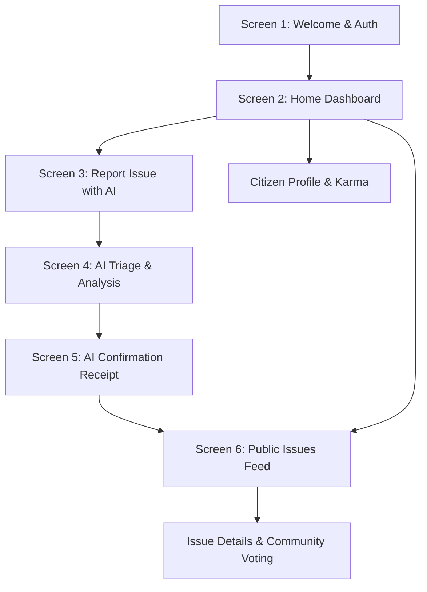

# 🏛️ Samadhan.ai (समाधान.ai)
### *Together for a Better Tomorrow — Civic Problem Crowdsourcing Platform*

[](https://reactjs.org/)
[](https://vitejs.dev/)
[](https://www.typescriptlang.org/)
[](https://tailwindcss.com/)
[](https://www.framer.com/motion/)

---

## 📌 About The Project

**Samadhan.ai** is an AI-powered civic engagement and problem crowdsourcing platform designed to bridge the gap between citizens, urban local bodies (municipal corporations), NGOs, and CSR entities. 

By empowering citizens to report hyper-local civic infrastructure challenges (potholes, water leaks, broken streetlights, waste accumulation) with automated AI verification and severity assessment, Samadhan.ai accelerates issue resolution and community transparency.

---

## ✨ Key Features

- 📸 **AI-Powered Issue Triage**: Automated image analysis, GPS reverse-geocoding, priority classification, and municipal department assignment.
- 📊 **Interactive Bento Dashboard**: Dynamic real-time metrics for Total Issues, High Priority, Pending Issues, In Progress, Resolved Issues, and Community Impact.
- 🗺️ **Public Civic Feed**: Interactive community voting, verification checks, status tracking, and civic karma rewards.
- 🌐 **7-Language Localization (i18n)**: Instant UI translation across English (`en`), Hindi (`hi`), Gujarati (`gu`), Marathi (`mr`), Bengali (`bn`), Tamil (`ta`), and Telugu (`te`).
- 🎨 **Adaptive Light Mode Design System**: Clean pastel and daylight aesthetics with ambient glows, glassmorphism widgets, and fluid micro-interactions powered by Framer Motion.
- 📱 **Responsive Viewport & Mobile Frame**: Dual testing support with real-time toggle between full desktop dashboard and mobile app frame (`430px`).

---

## 🛠️ Tech Stack

- **Framework / Library**: [React 18](https://react.dev/) + [TypeScript](https://www.typescriptlang.org/)
- **Build Tool**: [Vite](https://vitejs.dev/)
- **Styling**: [Tailwind CSS](https://tailwindcss.com/) + Custom Design Tokens
- **Animations**: [Framer Motion](https://www.framer.com/motion/)
- **Charts & Data Viz**: [Recharts](https://recharts.org/)
- **Icons**: [Lucide React](https://lucide.dev/)

---

## 🚀 Getting Started

### Prerequisites

Ensure you have **Node.js** (v18 or higher) and **npm** installed on your system.

### Installation

1. **Clone the repository**:
   ```bash
   git clone https://github.com/akshatmehta016/Samadhan.ai-Prototype-.git
   cd Samadhan.ai-Prototype-
   ```

2. **Install dependencies**:
   ```bash
   npm install
   ```

3. **Start the local development server**:
   ```bash
   npm run dev
   ```
   Open [http://localhost:5173](http://localhost:5173) in your browser to view the application.

4. **Build for production**:
   ```bash
   npm run build
   ```

---

## 🧭 Application Flow



---

## 🌐 Supported Languages

| Language | Code | Native Script |
| :--- | :---: | :--- |
| **English** | `en` | English |
| **Hindi** | `hi` | हिन्दी |
| **Gujarati** | `gu` | ગુજરાતી |
| **Marathi** | `mr` | मराठी |
| **Bengali** | `bn` | বাংলা |
| **Tamil** | `ta` | தமிழ் |
| **Telugu** | `te` | తెలుగు |

---

## 📄 License

This project is licensed under the MIT License — see the [LICENSE](LICENSE) file for details.
