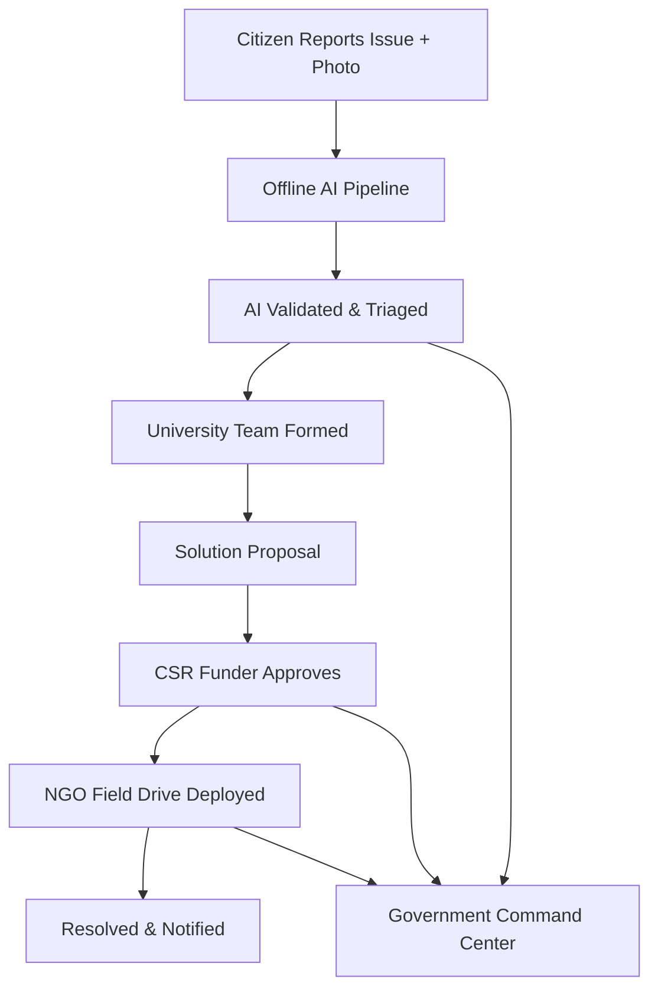

# 🏛️ Samadhan.ai (समाधान.ai)
### *Together for a Better Tomorrow — Civic Problem Crowdsourcing Platform*

[](https://nextjs.org/)
[](https://reactjs.org/)
[](https://www.typescriptlang.org/)
[](https://tailwindcss.com/)
[](https://www.mongodb.com/)
[](https://vercel.com)

---

## 📌 About The Project

**Samadhan.ai** is an AI-powered civic engagement and problem crowdsourcing platform that bridges citizens, universities, NGO volunteers, CSR funders, and the district administration.

Citizens report hyper-local civic infrastructure challenges (potholes, water leaks, broken streetlights, waste accumulation) with photos. An offline-first AI pipeline validates and triages each report, universities form solution teams, CSR funders release milestone-based grants, NGOs run on-ground field drives, and the **Government Command Center** gives the District Collector a live policy view.

---

## ✨ Key Features

- 📸 **AI-Powered Issue Triage**: Image + text analysis, priority classification, confidence scores, and university-match recommendations — runs fully offline (no external API key required).
- 📊 **Five Role-Specific Portals**: Citizen, University, NGO (CSR Funding + Field Drives + Volunteers), CSR Funder, and Government Command Center.
- 🗺️ **District Report Heatmap**: Interactive Leaflet map of Jharkhand with live per-district issue counts.
- 📡 **Live Analytics API**: `/api/stats/live`, `/api/analytics/districts`, `/api/analytics/categories`, `/api/analytics/trends`, `/api/analytics/leaderboard` — all derived from real DB aggregations.
- 🔔 **Real-Time Notifications**: 5s polling with an unread bell across all portals.
- 🏛️ **Government Command Center**: KPI counters, sector strike-rate, submission-vs-resolution trend, and university/district leaderboards.
- 🛠️ **Demo Data Reset**: One-click idempotent reseed to a deterministic 1,247-issue dataset.

---

## 🛠️ Tech Stack

- **Framework**: [Next.js 16](https://nextjs.org/) (App Router) + [React 19](https://react.dev/) + TypeScript
- **Database**: [MongoDB](https://www.mongodb.com/) via Mongoose 9
- **Styling**: [Tailwind CSS](https://tailwindcss.com/) v4
- **Charts & Maps**: [Recharts](https://recharts.org/) + [Leaflet](https://leafletjs.com/) / [react-leaflet](https://react-leaflet.js.org/)
- **Auth**: JWT (jose) signed session cookies, server-side role checks
- **Icons**: [Lucide React](https://lucide.dev/)

---

## 🚀 Getting Started

### Prerequisites

- **Node.js 20+** and **pnpm 9+**
- A **MongoDB Atlas** cluster (free tier is fine)

### Installation

1. **Clone the repository**:
   ```bash
   git clone https://github.com/akshatmehta016/Samadhan.ai-Prototype-.git
   cd Samadhan.ai-Prototype-
   ```

2. **Install dependencies**:
   ```bash
   pnpm install
   ```

3. **Configure environment variables** (see `.env.example`):
   ```bash
   cp .env.example .env
   ```
   Fill in `MONGO_URI` and a strong `JWT_SECRET`.

4. **Seed the demo database**:
   ```bash
   pnpm run seed
   ```

5. **Start the development server**:
   ```bash
   pnpm dev
   ```
   Open [http://localhost:3000](http://localhost:3000) in your browser.

6. **Lint & build**:
   ```bash
   pnpm lint
   pnpm build
   ```

### Environment Variables

| Variable | Required | Description |
| :--- | :---: | :--- |
| `MONGO_URI` | ✅ | MongoDB connection string |
| `JWT_SECRET` | ✅ | Secret used to sign session cookies |
| `AI_API_KEY` | ❌ | Optional external AI key; pipeline runs offline without it |
| `BLOB_READ_WRITE_TOKEN` | ❌ | Vercel Blob token for photo uploads |
| `ALLOW_RESET` | ❌ | Set `true` to expose `/api/dev/reset` in production |

---

## 👥 Demo Credentials

| Role | Email | Password | Portal |
| :--- | :--- | :--- | :--- |
| Citizen | `aarav@samadhan.ai` | `demo@1234` | Report + track issues |
| University | `arya@bit-mesra.ac.in` | `demo@1234` | Team pipeline |
| University Admin | `admin@bit-mesra.ac.in` | `demo@1234` | Full university management |
| NGO | `ananya@helplinghands.org` | `demo@1234` | Field drives, volunteers, CSR grants |
| CSR Funder | `gupta@tatasteelcsr.org` | `demo@1234` | Proposal review + funding |
| Government / Admin | `admin@samadhan.ai` | `admin@2026` | District Collector command center |

---

## 🧭 Application Flow



---

## 🗺️ Demo Data

The seed script creates a deterministic dataset so dashboards and analytics always show meaningful numbers:

- **1,247 issues** (354 reported · 892 AI-validated · 345 in-work · 89 deployed)
- 10 Jharkhand districts, 6 partner universities, 8 CSR funders, 3 NGO programs
- Can be re-generated at any time via `pnpm run seed` or the in-app **Reset** button (Government portlet, dev only)

---

## 📄 License

This project is licensed under the MIT License — see the [LICENSE](LICENSE) file for details.